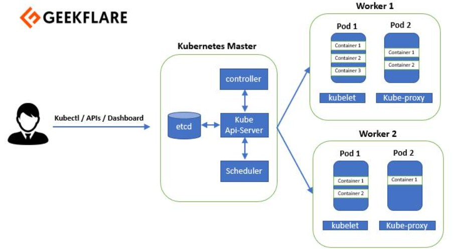

# ☸️ Kubernetes Architecture (K8s)

# 🧠 Kubernetes Architecture Overview
Kubernetes cluster mainly has two parts:
## 1. Control Plane
Responsible for:
* Managing cluster
* Making decisions
* Scheduling Pods
* Maintaining desired state

## 2. Worker Nodes
Responsible for:
* Running applications
* Running Pods
* Container execution

## 🏗️ Kubernetes Architecture Diagram


```
# ⚙️ Important Components I Learned

1.Control plane components
 
## API Server
* Entry point of Kubernetes
* Receives all cluster requests
* Communicates with all components
👉 Every Kubernetes request goes through API Server.

## Scheduler
* Decides where Pods should run
* Checks CPU and memory availability
👉 Helps in better resource management.

## etcd
* Kubernetes database
* Stores cluster state and configuration

## Controller Manager
* Maintains desired state
* Automatically recreates failed Pods
👉 Enables auto healing.

## Cloud Controller Manager (CCM)
*Used in cloud platforms like:
* AWS EKS
* Azure AKS
* Google GKE
It connects Kubernetes with cloud provider APIs.

2.worker node components

## kubelet
* Runs on every worker node
* Creates and monitors Pods
👉 kubelet manages Pods on nodes.

## kube-proxy
* Handles networking and load balancing
* Distributes traffic between Pods

## Container Runtime
Container runtime is responsible for running containers.
*Common runtimes:
- containerd
- CRI-O
👉 Runtime actually starts containers inside Pods.

# 🔄 How Kubernetes Works

Basic flow:

User
↓
kubectl
↓
API Server
↓
Scheduler
↓
Worker Node
↓
Pod Creation
↓
Application Running

# 🛠️ Hands-On Practice

## 1. Started Minikube Cluster

Started local Kubernetes cluster using Docker driver.

```bash
minikube start --driver=docker
```
## 2. Verified Cluster

```bash
kubectl get nodes
```
## 3. Created First Pod

```bash
kubectl run nginx --image=nginx
```
## 4. Verified Pod

```bash
kubectl get pods
```

## 5. Checked Pod Details

```bash
kubectl describe pod nginx
```
👉 I observed that scheduler selected the node automatically.

## 6. Checked Container Logs

```bash
kubectl logs nginx
```
## 7. Deleted Pod

```bash
kubectl delete pod nginx
```
# 🚀 Auto Healing Demo

## Created Deployment

```bash
kubectl create deployment myapp --image=nginx --replicas=2
```
## Verified Pods

```bash
kubectl get pods
```

## Tested Auto Healing

Deleted one Pod:

```bash
kubectl delete pod <pod-name>
```

# 📈 Auto Scaling Demo

Scaled deployment:

```bash
kubectl scale deployment myapp --replicas=5
```

# 📌 Important Concepts I Learned

* Pod = A Pod is the smallest deployment unit in Kubernetes.in simple words,Pod is a wrapper around one or more containers
* Deployment = A Deployment is a Kubernetes resource used to manage and maintain Pods automatically.
  In simple words, Deployment is a controller that creates, manages, scales, and updates Pods.
  It helps with:
  - Auto healing
  - Auto scaling
  - Rolling updates
  - Managing replicas

# 🚀 Key Understanding

I learned how Kubernetes architecture works internally and how different components communicate with each other.
It helps with:
* Auto healing
* Auto scaling
* Load balancing
* Cluster management
* Production orchestration

