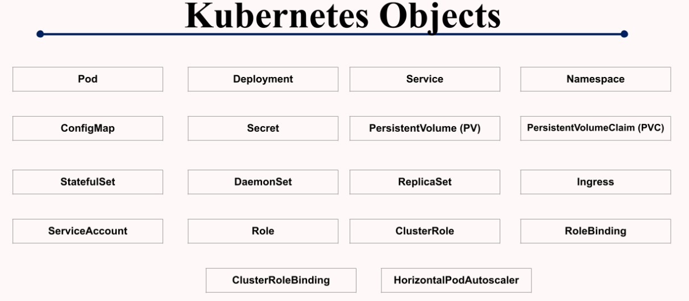
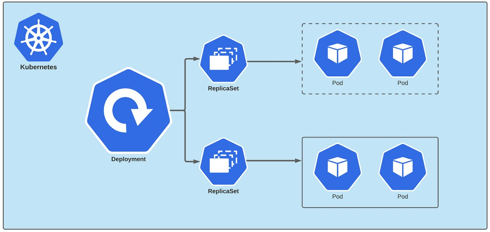

# ☸️ Kubernetes Objects and API Versions

# 🧠 Kubernetes Objects Overview

Kubernetes objects are persistent entities used to manage the state of the Kubernetes cluster.

They define:

- Which applications are running
- Which container images are used
- Resource allocation
- Application behavior and configuration

# 🧩 Kubernetes Objects Overview Diagram

The following diagram shows commonly used Kubernetes objects and resources.



# 🔢 Kubernetes API Versions

Kubernetes uses API versions to manage resource stability and compatibility.

## 📌 API Version Stages

### Alpha (`v1alpha1`)
- Early development stage
- Features may change significantl

### Beta (`v1beta1`)
- More stable than alpha
- Features are well tested
- Still subject to changes

### Stable (`v1`)
- Fully stable and production-ready
- Backward compatibility maintained

# 📦 Common Kubernetes Objects

## 1. Pod

A Pod is the smallest and simplest deployable object in Kubernetes.

### 🔑 Key Features of Pod

- Smallest deployment unit in Kubernetes
- Runs one or more containers together
- Containers inside a Pod share:
  - Network
  - Storage
  - IP Address
  - Configuration options
- Ephemeral in nature (can be recreated anytime)
- Managed automatically by higher-level objects like Deployments
- 
## 2. Deployment

A Deployment is a Kubernetes object used to manage Pods declaratively.

It helps Kubernetes maintain the desired application state automatically.

### 🔑 Key Features of Deployment

- Declarative updates
- Auto healing
- Auto scaling
- Rolling updates
- Rollbacks
- Replica management

### ⚙️ Components of a Deployment

- Selector → Identifies Pods managed by Deployment
- Template → Defines Pod configuration
- Replicas → Defines number of Pod replicas

# 🚀 Kubernetes Deployment Architecture

The following diagram explains how Deployment manages ReplicaSets and Pods internally.



## 3. ReplicaSet

A ReplicaSet is a Kubernetes controller that maintains the desired number of Pod replicas in the cluster.

### 🔑 Key Features of ReplicaSet

- Maintains desired number of Pods automatically
- Continuously compares:
  - Desired State
  - Actual State
- Automatically recreates Pods if:
  - Pod crashes
  - Pod gets deleted
  - Node fails
- Provides:
  - Auto Healing
  - Self Recovery
- Uses Reconciliation Loop to maintain cluster state
- Managed automatically by Deployments

# 🛠️ Hands-On Practice — Lab 1

# 🚀 Creating and Managing Deployments

## STEP 1 — Create Deployment YAML File

```bash
vim deployment.yaml
```
## STEP 2 — Apply Deployment

```bash
kubectl apply -f deployment.yaml
```

## STEP 3 — Verify Resources

### Check Deployment

```bash
kubectl get deployments
```

### Check ReplicaSet

```bash
kubectl get rs
```

### Check Pods

```bash
kubectl get pods
```

# 🔄 Auto Healing Demo

Delete a Pod manually:

```bash
kubectl delete pod <pod-name>
```
👉 ReplicaSet automatically creates a new Pod to maintain the desired state.

# 📈 Scaling Deployment

Increase replicas:

```yaml
replicas: 3
```

Apply changes:

```bash
kubectl apply -f deployment.yaml
```

Verify Pods:

```bash
kubectl get pods
```
👉 Kubernetes automatically creates additional Pods.

# 🚀 Key Understanding

I learned how Kubernetes objects work together internally and how Kubernetes continuously maintains the desired cluster state automatically.

Key concepts learned:

- Pod management
- Replica management
- Desired state management
- Auto healing
- Horizontal scaling
- Deployment architecture
- Kubernetes controllers
- Reconciliation Loop
 Kubernetes automates application deployment, scaling, and recovery efficiently.
