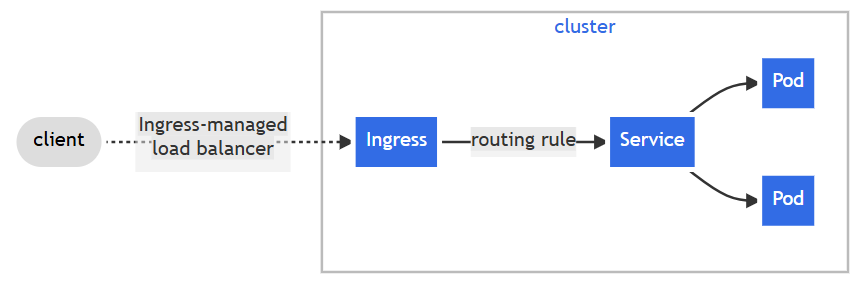

# ☸️ Kubernetes Ingress

## 🧠 Why Do We Need Ingress?

Before Ingress, Kubernetes mainly used:

### 1. NodePort
Opens a static high port on every Kubernetes node.

### ❌ Problems with NodePort

* Hard to remember ports
* Not user friendly
* No domain-based routing
* No HTTPS support
* Less secure

### 2. LoadBalancer
Creates an external cloud load balancer for every Service.
### ❌ Problems with LoadBalancer
* Expensive
* Multiple services require multiple public IPs
* Limited routing features

## ✅ How Ingress Solves These Problems

Ingress provides:

* Single entry point for applications
* Domain-based routing
* Path-based routing
* HTTPS/TLS support
* Better traffic management
* Lower infrastructure cost

# 🧩 What is Kubernetes Ingress?

Ingress is a Kubernetes object used to expose applications to the outside world using HTTP and HTTPS.

Instead of assigning every application its own public IP or port, Ingress acts like a smart traffic manager that routes requests to the correct Service inside the cluster.

# 🖼️ Kubernetes Ingress Architecture


# ⚙️ Main Components of Ingress

Ingress setup has two important parts.

## 1. Ingress Resource

The Ingress Resource is the YAML configuration file where routing rules are defined.

### 🔑 Responsibilities

* Define domains
* Configure URL paths
* Configure TLS/HTTPS settings
* Route traffic to Services

### ⚠️ Important

Ingress Resource only contains rules.

It does NOT handle traffic directly.

## 2. Ingress Controller

The Ingress Controller is the actual application responsible for reading Ingress rules and applying them.

Without an Ingress Controller, Ingress will not work.

### Popular Ingress Controllers

* NGINX Ingress Controller
* Traefik
* AWS ALB Controller
* GCE Ingress Controller

# 🚀 How Ingress Works

## Step-by-Step Flow

```text
User Request
      ↓
DNS resolves domain
      ↓
Ingress Controller receives traffic
      ↓
Ingress rules are evaluated
      ↓
Traffic routed to Kubernetes Service
      ↓
Service forwards traffic to Pods
```

# 🌐 Important Features of Ingress

## 1. Host-Based Routing

Routes traffic using domain names.

### Example
```text
api.example.com   → api-service
blog.example.com  → blog-service
```
## 2. Path-Based Routing

Routes traffic using URL paths.

### Example
```text
/example/api      → api-service
/example/images   → image-service
```
## 3. HTTPS / TLS Support

Ingress can manage secure HTTPS traffic.

### Benefits
* Secure communication
* SSL certificate management
* Centralized HTTPS handling

### Commonly Used Tools
* cert-manager
* Let's Encrypt

# 🛠️ Hands-On Practice — Lab

## STEP 1 — Verify Existing Pods
```bash
kubectl get pods
```
## STEP 2 — Create Service
```bash
kubectl apply -f service.yaml
```
### Verify Service
```bash
kubectl get svc
```
## STEP 3 — Create Ingress Resource

### Create Ingress YAML
```bash
vim ingress.yaml
```
### Apply Ingress
```bash
kubectl apply -f ingress.yaml
```
### Verify Ingress
```bash
kubectl get ingress
```
## STEP 4 — Install NGINX Ingress Controller
```bash
minikube addons enable ingress
```
### Verify Controller Installation
```bash
kubectl get pods -A | grep nginx
```
## STEP 5 — Check Controller Logs
```bash
kubectl logs -n ingress-nginx <controller-pod-name>
```
## STEP 6 — Verify Ingress Address
```bash
kubectl get ingress
```
## STEP 7 — Test Ingress
```bash
curl http://myflaskapp.dev
```

# 🔑 Key Understanding

I learned how Kubernetes Ingress provides advanced external traffic management for applications running inside Kubernetes.

### Key Concepts Learned

* Centralized external access
* Host-based routing
* Cost optimization using a single Load Balancer
* Ingress Controller architecture
* Traffic routing to Services and Pods
Kubernetes Ingress makes application traffic management scalable, secure, and production-ready for enterprise environments.
