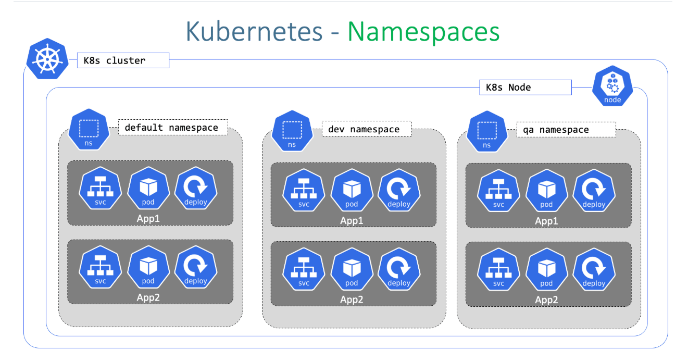
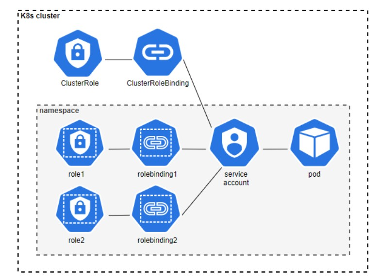

☸️ Kubernetes Namespaces and RBAC (Role-Based Access Control)

# 📦 KUBERNETES NAMESPACES

🧠 Why Do We Need Namespaces?
In Kubernetes, multiple teams and applications often share the same cluster.

Without Namespaces:
❌ Resource naming conflicts  
❌ Difficult environment separation  
❌ Poor resource organization  
❌ Hard access management  
✅ Namespaces solve these problems by logically isolating resources inside a cluster.

🧩 What is a Namespace?

A Namespace is a logical partition inside a Kubernetes cluster used to organize and isolate resources.

Resources inside one Namespace are separated from resources in another Namespace.

 🚀 Kubernetes Namespace Architecture

The following diagram explains how Namespaces logically separate resources inside a Kubernetes cluster.

✅ Why Namespaces Are Important

• Resource Isolation-Different teams can safely use the same resource names.

• Environment Separation-Useful for dev, staging, and production environments.

• RBAC Integration-Permissions can be controlled per Namespace.

• Resource Management-Supports quotas for CPU, Memory, Pods, and Storage.

• Better Organization-Improves workload and team management.

⚙️ Namespace-Scoped Resources

 • Pods  
 • Deployments  
 • Services  
 • ConfigMaps  
 • Secrets  

🌐 Cluster-Scoped Resources

 • Nodes  
 • StorageClasses  
 • PersistentVolumes  
 • ClusterRoles  
 • Namespaces themselves  

🛠️ Hands-On Lab — Namespaces

STEP 1 — List Namespaces

kubectl get ns

STEP 2 — Create Namespace

kubectl create namespace my-new-app

STEP 3 — Deploy into Namespace

kubectl apply -f deployment.yaml -n my-new-app

STEP 4 — View Resources

kubectl get pods -n my-new-app

STEP 5 — View All Namespaces

kubectl get pods --all-namespaces

STEP 6 — Switch Current Namespace

kubectl config set-context --current --namespace=my-new-app

STEP 7 — Delete Namespace

⚠️ Warning:
Deleting a Namespace removes all resources inside it.

kubectl delete namespace my-new-app

# 🔐 KUBERNETES ROLE-BASED ACCESS CONTROL (RBAc)

🧠 Why Do We Need RBAC?

RBAC controls who can access and manage Kubernetes resources.
Without RBAC:
❌ Unauthorized access to resources  
❌ Accidental workload deletion or modification  
❌ Security and compliance risks  
❌ Excessive application permissions  

✅ RBAC improves Kubernetes security and governance.

🧩 What is Kubernetes RBAC?

RBAC (Role-Based Access Control) is the authorization system used in Kubernetes.

It controls:

• Who can perform actions  
• What actions they can perform  
• Which resources they can access  
• Where permissions apply 

🚀 Kubernetes RBAC Architecture

The following diagram explains how RBAC controls access and permissions for users, ServiceAccounts, and workloads inside a Kubernetes cluster.

⚙️ Main Components of RBAC

🔹Role-Defines permissions inside a specific Namespace.

Used for:
• Pods  
• Deployments  
• Services  
• Secrets  

🔹ClusterRole-Defines permissions across the entire cluster.

Used for:
• Nodes  
• StorageClasses  
• All Namespaces  

🔹RoleBinding-Connects a Role or ClusterRole to:

• User  
• Group  
• ServiceAccount  

inside a Namespace.

🔹 ClusterRoleBinding-Grants ClusterRole permissions across the cluster.

👤 Subjects in RBAC

🔹 User-Human users accessing Kubernetes.

Examples:
• Developers  
• Admins  
• DevOps Engineers  

🔹 Group-Collection of users for team-based access management.

🔹 ServiceAccount-Identity used by applications and Pods inside Kubernetes.

🔑 Important Concept:
Pods use ServiceAccounts to securely communicate with the Kubernetes API.

⚠️ Default Behavior:
Every Namespace automatically receives a default ServiceAccount.

🔐 Authentication vs Authorization

ServiceAccount → Authentication  
(Who is accessing)

RBAC → Authorization  
(What actions are allowed)

🚀 How RBAC Works

Request sent to API Server
        ↓
Authentication performed
        ↓
RBAC checks permissions
        ↓
Role / ClusterRole rules evaluated
        ↓
Access granted or denied

🧠 RBAC Rule Matching

RBAC checks:

• Verb → Action  
(get, create, delete)

• Resource → Object  
(pods, deployments, secrets)

• API Group → Resource Category  
(core, apps, batch)

✅ If a matching rule exists → Access Allowed

❌ If no rule matches → Access Denied

🧪 RBAC Hands-On Lab

STEP 1 — Create Namespace

kubectl create namespace my-app

STEP 2 — Create ServiceAccount

kubectl apply -f serviceaccount.yaml

STEP 3 — Create Role

kubectl apply -f role.yaml

STEP 4 — Create RoleBinding

kubectl apply -f rolebinding.yaml

STEP 5 — Create Test Pod

STEP 6 — Verify Permissions

kubectl auth can-i get pods --as system:serviceaccount:my-app:default

🔑 Key Understanding

I learned how Kubernetes Namespaces and RBAC work together to provide secure, organized, and scalable cluster management.

🚀 Skills & Concepts Gained
 • Logical resource isolation  
 • Environment separation  
 • Access control management  
 • Least privilege security  
 • Role and permission management  
 • Multi-team collaboration  
 • Secure API access    
Kubernetes Namespaces organize workloads while RBAC secures access to those resources across the cluster.

⭐ Best Practices

- Use separate Namespaces for dev, staging, and production environments
- Follow the Principle of Least Privilege when assigning permissions
- Use dedicated ServiceAccounts instead of default ServiceAccounts in production
- Regularly review and audit RBAC Roles and RoleBindings
- Keep workloads isolated and securely managed

✅ Final Conclusion

- Namespaces and RBAC are essential Kubernetes features for organizing and securing cluster resources.
- Namespaces provide logical isolation, while RBAC enforces controlled access to workloads and applications.
Together, they enable secure, scalable, and production-ready Kubernetes environments for modern cloud-native