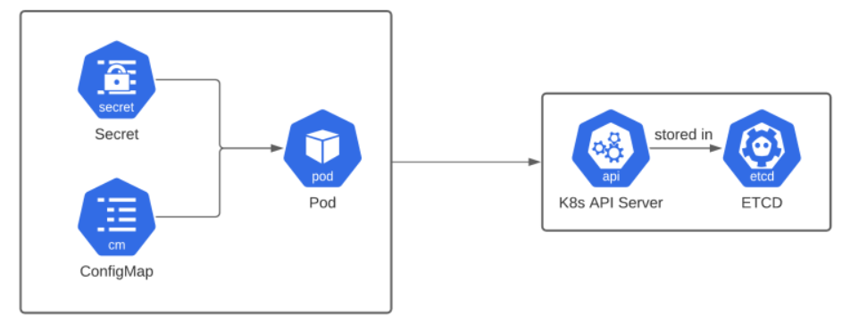

## ☸️ Kubernetes ConfigMaps & Secrets

## Overview

Kubernetes applications should separate configuration data from container images and application code.

Hardcoding configuration inside containers creates several problems:

- Difficult configuration updates
- Environment-specific container images
- Rebuilding images for every change
- Poor portability across environments
- Security risks for sensitive information

Kubernetes solves this problem using:
- ConfigMaps → store non-sensitive configuration
- Secrets → store sensitive application data securely
This approach helps applications become:
- Portable
- Scalable
- Secure
- Production-ready

🧠 Core Concept
Kubernetes dynamically injects configuration into Pods using:
- Environment Variables
- Volume Mounts
This helps applications:
- Separate configuration from application code
- Manage runtime configuration easily
- Support cloud-native deployment practices
- Improve security and maintainability

# 🚀 ConfigMaps and Secrets architecture

The following diagram explains how ConfigMaps and Secrets interact with Pods and the Kubernetes API Server.



# 🏗️ Architecture / Flow

Application Deployment
↓
Pod Creation
↓
ConfigMap / Secret Attached
↓
Configuration Injected into Pod
↓
Application Reads Configuration
↓
Dynamic Configuration Management

# 🏗️ Key Components

ConfigMap-Stores non-sensitive configuration data as key-value pairs.

Examples:
- Application settings
- Environment variables
- Feature flags
- Configuration files

Secret-Stores sensitive information securely.

Examples:
- Database passwords
- API keys
- OAuth tokens
- TLS certificates

Environment Variables-Inject configuration values during container startup.

Volume Mounts-Mount ConfigMap or Secret data as files inside containers.

Kubelet-Runs on worker nodes and automatically updates mounted ConfigMaps and Secrets.

etcd-Kubernetes database that stores cluster configuration and resource state.

RBAC-Controls access permissions for Kubernetes resources including Secrets.

🧱 Hands-On Implementation

⚙️ ConfigMap Implementation

1. Created ConfigMap Successfully

Created a ConfigMap to externalize application configuration.

2. Injected ConfigMap into Deployment Using Environment Variables
```
env:
- name: DB_PORT
  valueFrom:
    configMapKeyRef:
      name: test-cm
      key: DB_PORT
```

3. Applied Deployment
```
kubectl apply -f deployment.yaml
```
4. Verified Environment Variable Inside the Pod
```
kubectl exec -it POD_NAME -- /bin/bash
```
Verified the injected variable using:
```
env | grep DB
```
5.Modified the ConfigMap values and reapplied the configuration.

🔄 ConfigMap Update Behavior-Environment Variables

❌ Running Pods do NOT automatically receive updated ConfigMap values.

Environment variables are loaded only during container startup.

👉 Pod restart or rolling restart is required to load updated values.

# 🔐 Secret Implementation

 1. Created Kubernetes Secret
```
kubectl create secret generic test-secret \
--from-literal=DB_PASSWORD=mysecret
```
 2. Verified Secret
```
kubectl get secret
```
3. Mounted Secret into Deployment

Configured the Secret as a volume inside the Deployment.

4. Applied Deployment
```
kubectl apply -f secret-volume.yaml
```
5. Verified Mounted Secret Inside the Pod
```
kubectl exec -it POD_NAME -- /bin/sh
```
Navigate to mounted directory:
```
cd /etc/secret-data
```
🔄 Secret Rotation Demo

1. Deleted Existing Secret
```
kubectl delete secret test-secret
```
2. Recreated Secret with Updated Value
```
kubectl create secret generic test-secret \
--from-literal=DB_PASSWORD=newpassword123
```
3. Verified Updated Secret
```
cat /etc/secret-data/DB_PASSWORD
```
✅ Mounted Secret updated automatically inside the container.

🔄 Secret Update Behavior-Volume Mounts

✅ Mounted Secret files update automatically without restarting Pods.

👉 Preferred approach for dynamic and production-grade secret management.

❌ Problems Faced

1. ConfigMap Updates Not Reflecting

Fix- Used rolling restart for Deployment and verified updated environment variables successfully

2.Problem — Secret Update Delay

Fix - Waited for Kubelet synchronization, re-entered Pod and verified updated Secret successfully

🔑 Key Learnings
✔ ConfigMaps store non-sensitive configuration data
✔ Secrets store sensitive application data securely
✔ Environment variables require Pod restart after updates
✔ Volume mounts support automatic configuration updates
✔ Base64 encoding is NOT encryption
✔ RBAC improves Secret security
✔ Kubernetes supports externalized configuration management
✔ Volume mounts are preferred in production environments

💡 Final Insight
Kubernetes ConfigMaps and Secrets provide secure and flexible configuration management for cloud-native applications.
For production environments:
- Use ConfigMaps for non-sensitive configuration
- Use Secrets for sensitive application data
- Prefer volume mounts for dynamic updates
- Enable RBAC and encryption for better security
- Rotate secrets regularly to improve security
- Avoid hardcoding credentials inside applications
- Use external secret management tools in enterprise environments
👉 Proper configuration management is essential for scalable, secure, and production-ready Kubernetes deployments.
