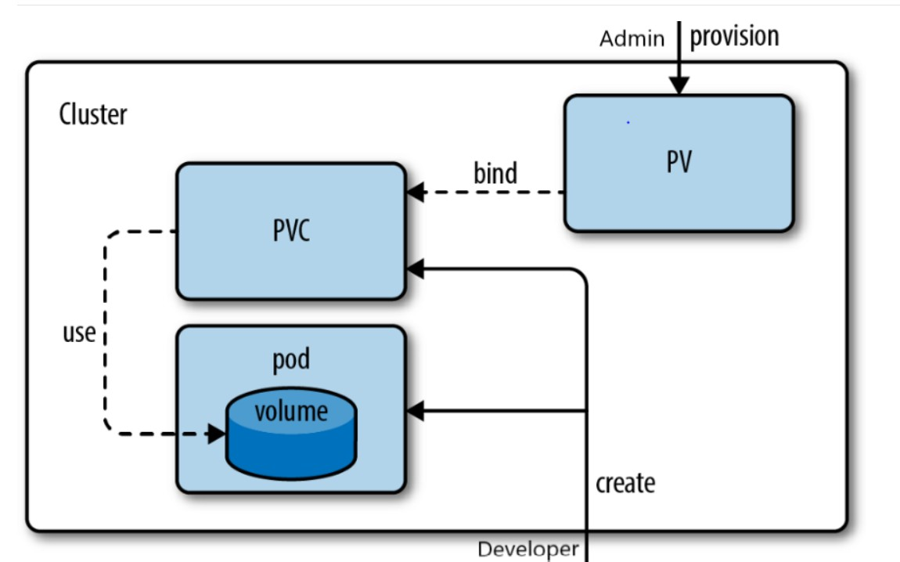

# 💾 Kubernetes Persistent Storage (PV, PVC, StorageClass & CSI)

## 🧠 Why PV and PVC Exist

In Kubernetes, Pods are ephemeral and can be deleted, recreated, or moved to another node at any time.

In the previous lab, I used an `emptyDir` volume to attach storage to a Pod. While this allowed data to survive container restarts, the data was permanently lost when the Pod was deleted.

This behavior is acceptable for temporary data, but real-world applications need their data to persist independently of Pod lifecycle events.

#### Kubernetes solves this problem using Persistent Volumes (PVs) and Persistent Volume Claims (PVCs).

### 🧠 Core Concept

Kubernetes separates storage consumption from storage provisioning.

#### Static Provisioning

In static provisioning, administrators manually create Persistent Volumes (PVs), and applications request storage using Persistent Volume Claims (PVCs).

PVs provide persistent storage resources, while PVCs allow applications to request and consume storage without needing to know the underlying infrastructure details.

#### Dynamic Provisioning

In dynamic provisioning, administrators create a StorageClass instead of manually creating PVs.

When a PVC requests storage, Kubernetes automatically provisions a matching Persistent Volume using the configured CSI Driver.

This eliminates manual storage management and is the preferred approach in modern Kubernetes environments.

This abstraction provides:

- Portability

- Flexibility

- Infrastructure independence

- Automated storage provisioning

This enables applications to become:

- Stateful

- Reliable

- Scalable

- Production-ready

### 🚀 Persistent Storage Architecture

The following diagram explains how Persistent Volumes (PVs), Persistent Volume Claims (PVCs),and Pods interact to provide persistent storage in Kubernetes.

### 🏗️ Key Components

1.Persistent Volume (PV) - Represents a storage resource available in the Kubernetes cluster.

Key Characteristics:

- Cluster-scoped resource
- Independent of Pod lifecycle
- Represents actual storage
- Can be created manually or dynamically

Examples:

AWS EBS
Azure Disk
Google Persistent Disk
NFS
Ceph
Local Storage

2.Persistent Volume Claim (PVC)- A request for storage made by an application.

Developers define:

- Storage size
- Access mode
- Storage class

Kubernetes automatically finds or creates a matching PV.

3.StorageClass-Defines how storage should be provisioned.

Benefits:

* Dynamic provisioning
* Storage automation
* Reduced manual effort
* Cloud-native storage management

4.CSI Driver-Container Storage Interface (CSI) is the standard interface between Kubernetes and storage providers.

CSI Drivers allow Kubernetes to communicate with:

* AWS EBS
* Azure Disk
* Google Persistent Disk
* NFS
* Ceph

Benefits:

* Vendor independence
* Faster storage integrations
* Better scalability
* Easier maintenance

### 🔑 Important Concepts

### Access Modes

| Mode                    | Description               |
| ----------------------- | ------------------------- |
| ReadWriteOnce (RWO)     | One node can read/write   |
| ReadOnlyMany (ROX)      | Multiple nodes read only  |
| ReadWriteMany (RWX)     | Multiple nodes read/write |
| ReadWriteOncePod (RWOP) | Single Pod can read/write |

### PV States

| State     | Description                   |
| --------- | ----------------------------- |
| Available | Ready to be claimed           |
| Bound     | Connected to PVC              |
| Released  | PVC deleted, storage retained |
| Failed    | Storage provisioning error    |

### Reclaim Policies

| Policy  | Behavior                        |
| ------- | ------------------------------- |
| Retain  | Keep storage after PVC deletion |
| Delete  | Remove storage automatically    |
| Recycle | Deprecated                      |

### 🧱 What I Implemented

- Created a Persistent Volume using hostPath

- Created a Persistent Volume Claim requesting storage

- Verified successful PV-PVC binding

- Attached PVC to a Pod

- Created persistent data inside the Pod

- Deleted and recreated the Pod

- Verified data persistence after Pod recreation

- Understood static provisioning workflow

### 🔑 Key Learnings

- Containers are ephemeral

- Persistent storage exists independently of Pod lifecycle

- Pods consume PVCs, not PVs directly

- PV and PVC have a one-to-one binding relationship

- StorageClasses enable dynamic provisioning

- CSI Drivers integrate Kubernetes with storage providers

- Dynamic provisioning is preferred in production environments

# 💡 Final Insight

Persistent storage separates application lifecycle from data lifecycle.

By using PVs, PVCs, StorageClasses, and CSI Drivers, Kubernetes ensures application data remains available even when Pods are deleted, recreated, or rescheduled.

Persistent storage is the foundation for running reliable stateful workloads in Kubernetes.
