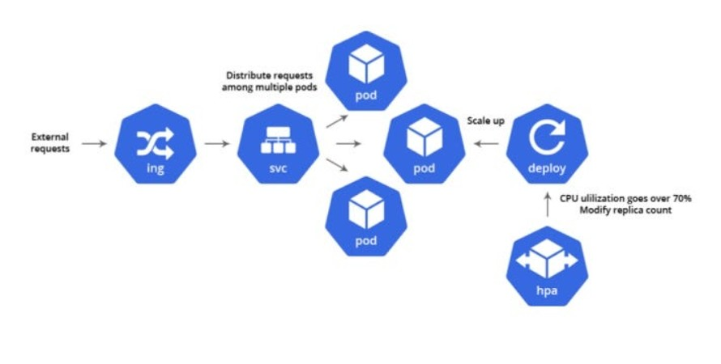

# 🚀 Kubernetes Horizontal Pod Autoscaler (HPA)

## Overview

Applications rarely receive the same amount of traffic all the time.

During peak load, additional Pods may be required, while during low traffic, running extra Pods wastes resources.

The Horizontal Pod Autoscaler (HPA) automatically adjusts the number of Pod replicas based on workload demand.

This helps applications remain available while optimizing resource usage.

## 🧠 Core Concept

Instead of manually scaling Deployments, Kubernetes automatically scales Pods by monitoring resource utilization and application metrics.

HPA continuously:

* Monitors metrics
* Compares them with target values
* Increases or decreases Pod replicas when required

## 🚀 Kubernetes Horizontal Pod Autoscaler (HPA) Architecture

The following diagram explains how the Horizontal Pod Autoscaler (HPA) automatically monitors application metrics and scales Pods based on workload demand.

## 🏗️ Key Components

• HPA Controller → manages automatic scaling

• Metrics Server → provides CPU and Memory metrics

• scaleTargetRef → identifies workload to scale

• minReplicas → minimum Pods maintained

• maxReplicas → maximum Pods allowed

• Target Metrics → desired utilization value

# 🧱 Hands-On Implementation (Minikube)

✔ Created Deployment for application

✔ Verified Metrics Server availability

✔ Configured CPU utilization target

✔ Created Horizontal Pod Autoscaler

✔ Generated workload to simulate traffic

✔ Observed automatic Pod scaling

✔ Verified replica count changes successfully

## ❌ Problems Faced

- Problem 1 — Metrics API Not Available
- Fix:Enabled and ensured Metrics Server was running properly

- Problem 2 — Deployment Not Found by HPA
- Fix:Updated HPA YAML with the correct Deployment name and reapplied:

# 🔑 Key Learnings

✔ HPA automatically scales Pods based on workload demand

✔ Metrics Server is required for resource-based scaling

✔ CPU and Memory requests should be configured correctly

✔ minReplicas and maxReplicas control scaling boundaries

✔ HPA helps improve availability and resource efficiency

✔ Automatic scaling reduces manual operational effort

✔ Proper Deployment references are required in HPA configuration

✔ Stabilization mechanisms help prevent frequent scaling changes

# 💡 Final Insight

Horizontal Pod Autoscaler (HPA) enables Kubernetes workloads to automatically adapt to changing traffic conditions. By dynamically increasing or decreasing Pod replicas based on resource usage, HPA improves application availability, optimizes cluster resources, and reduces the need for manual scaling operations. 