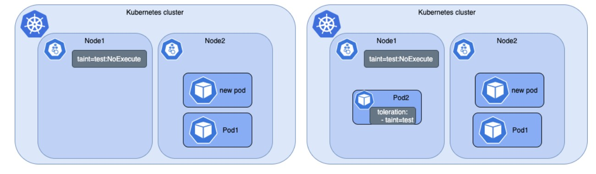

# 🚀 Kubernetes Taints, Tolerations & DaemonSets

## Overview

In Kubernetes, not every workload should run on every node.

Some nodes may be dedicated for GPUs, databases, monitoring tools, or other specialized workloads. Allowing all Pods to run everywhere can lead to inefficient resource usage and operational issues.

**Taints and Tolerations** help control Pod placement by restricting which Pods can run on specific nodes.

**DaemonSets** ensure that a Pod runs on all required nodes, making them ideal for cluster-wide services such as monitoring, logging, and security agents.

## 🧠 Core Concept

Kubernetes Scheduler normally places Pods on any available node.

Taints add restrictions to nodes, while Tolerations allow specific Pods to bypass those restrictions.

Together they provide controlled workload scheduling.

**Scheduling Flow:**

* Node is protected using a Taint
* Scheduler checks whether a Pod has a matching Toleration
* If matched → Pod can be scheduled
* If not matched → Pod is rejected

DaemonSets can use Tolerations to ensure their Pods run even on protected nodes.

## 🚀 Kubernetes Taints, Tolerations Architecture

The following diagram demonstrates how Kubernetes enforces node-level scheduling restrictions using Taints and Tolerations. A tainted node rejects regular Pods, while workloads with matching tolerations, such as monitoring agents deployed through DaemonSets, are permitted to run on the protected node.

## 🏗️ Key Components

• **Taint** → Restricts Pods from being scheduled on a node

• **Toleration** → Grants a Pod permission to use a tainted node

• **Scheduler** → Evaluates taints and tolerations during scheduling

• **DaemonSet** → Ensures a Pod runs on all eligible nodes

• **Node Labels** → Identify specialized nodes such as GPU nodes

• **Effects** → Define how Kubernetes enforces taints

## ⚙️ Taint Effects

### NoSchedule

Prevents new Pods from being scheduled unless they have a matching Toleration.

### PreferNoSchedule

A soft restriction that discourages scheduling but does not strictly block it.

### NoExecute

Prevents new Pods from scheduling and evicts existing Pods that do not tolerate the taint.

## ⚙️ Toleration Operators

### Exists

Allows a Pod to tolerate any taint with the specified key.

### Equal

Allows a Pod to tolerate a taint only when both the key and value match.

## 🧱 Hands-On Implementation 

✔ Created a multi-node Minikube cluster

✔ Applied a NoSchedule taint to the GPU node

✔ Deployed a standard application and verified scheduling restrictions

✔ Created a DaemonSet for a monitoring agent

✔ Added a matching Toleration to the DaemonSet

✔ Verified DaemonSet Pods successfully ran on all nodes, including the tainted node

❌ Problems Faced

Problem 1 — DaemonSet Pod Missing on Tainted Node

Fix: Added the required Toleration to the DaemonSet specification.

Problem 2 — Taint Configuration Not Applied Correctly

Fix: Verified node configuration 

## 🔑 Key Learnings

✔ Taints protect nodes from unwanted workloads

✔ Tolerations allow approved Pods to access protected nodes

✔ DaemonSets respect taints and require matching tolerations

✔ NoSchedule, PreferNoSchedule, and NoExecute serve different scheduling purposes

✔ Node labels and taints are commonly used together

✔ Dedicated nodes improve resource isolation and workload management

## 💡 Final Insight

Taints and Tolerations provide Kubernetes with fine-grained control over workload placement, ensuring that specialized nodes are used only by authorized workloads. When combined with DaemonSets, they enable critical services such as monitoring, logging, and security agents to run consistently across the cluster while maintaining proper resource isolation and scheduling control.
